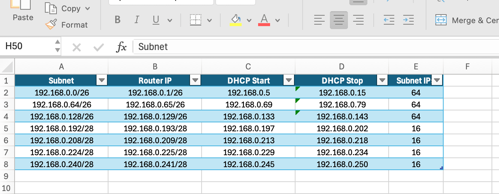

# Excel IP Functions

## A complete suite of Excel Functions to manipulate IPv4 and IPv6 addresses in Microsoft Excel.

These tools are a incredibly useful for anyone who needs to interact with IP addresses in any forms. They can help you with such queries:
- What is the network address, subnet mask or broadcast address?
- What is the next or previous subnet?
- I need a list of subnets in a summary?
- Is an address or network in a multicast or private range?

These tools help you answer all of those queries and many, many more. Typical use cases would be:
- Extract/analyse data from routing or forwarding tables
- Generate dynamic configuration files for device IP interfaces or routing protocols
- Create complex, dynamic IP addressing schemes

There are now two versions of the tools available.

## NEW IN 2025: IP Formulas

I have now developped a formula based suite of functions to manipulate IPv4 addresses.
There are two major benefits to the formula based suite:
- They run on Excel Online
- They run in standard .xls workbooks, no need for a .xlsm macro enabled workbook

They do support most features from formatting to sorting and subnetting.

The two main restrictions:
- They required Excel 365
- They only support IPv4

NEW: 15/04/2025 "ip.filter_include" and "ip.filter_exclude" to filter a list of subnets that belong/don't belong to a supernet.

### Utilisation

The functions are extremely easy to use. Just type "=ip." in a cell and all the available functions will be displayed. Most functions take input in the form of a dotted ip address (i.e. 192.168.0.1) or a dotted IP address and a prefix length (i.e. 192.168.0.1/24). There are functions to accept or return data from/to any other format (i.e. hostmask, netmask, binary,...).

ip.network_address
ip.broadcast_address
ip.previous_subnet
ip.next_subnet
ip.first_host_address
ip.previous_host_address
ip.next_host_address
ip.last_host_address
ip.offset

The module includes countless functions so I highly recommend using my instruction XLS file to view all the functions and understand how to use them:
[Excel IP Functions User Guide.xls](Formula/Excel%20IP%20Functions%20User%20Guide.xls)

### Installation

Easy Installation:
The easiest way to use those function is to simply download the blank workbook [Excel IP Functions.xls](Formula/Excel%20IP%20Functions%20Blank%20Workbook.xlsm) and start using the functions.

If you need to add the functions to an existing workbook, the easiest way is to open the [Excel IP Functions.xls](Formula/Excel%20IP%20Functions%20Blank%20Workbook.xlsm) and copy the only blank sheet it contains to your existing workbook. That will also add the module to your workbook. The copied sheet can immediately be deleted.

Manual Installation:
* Install [Microsoft Excel Labs]([VBA/Excel%20IP%20Functions.bas](https://appsource.microsoft.com/en-us/product/office/wa200003696?tab=overview)).
* create a new workbook and launch Excel Labs.
* Enter the Advanced Formula environment and select "Module".
* Click the import module icon and paste the following URL: https://gist.github.com/ngrison/54836a2e14f79da7612fe7b4ca5ee536
* I strongly recommend to select "Add formulas to new module" and to name the new module "ip".

The functions are now available to use in the 

## Classic VBA Based Functions

If you do need to manipulate IPv6 addresses, or use an older version of Excel, my classic VBA based fucntions are still available.

They do support IPv4 and IPv6.

### Utilisation

When installed and enabled in the workbook, all functions become available in formulas and begin with "ip". Just type"=ip" in a cell and you will see the list of functions.
The functions have specific options to format the output.

Some examples of available function:
ipAddress: Get the ip address of a ip/prefix pair
ipHostX: Get the Xth host address from the beginning of a subnet
ipHostY: Get the Yth host address from the end of a subnet
ipHostFirst: Get the first host address in a subnet
ipHostPrev: Get the previous host address in a subnet
ipHostNext: Get the next host address in a subnet
ipHostLast: Get the last host address in a subnet
ipHostCount: Get the number of host addresses in a subnet
ipSubAddress: Get the network address
ipSubMask: Get the subnet mask
ipSubBroadcast: Get the Broadcast address
ipSubPrev: get the previous subnet
ipSubNext: Get the next subnet

The modules include countless more functions and format options so I highly recommend using my instruction XLSM file to view all the functions and see how they work:
[Excel IP Functions.xlsm](VBA/Excel%20IP%20Functions.xlsm)

### Installation

Manual Installation:
Create a new macro-enabled workbook, open the VBA environment and import the .bas and .cls files in the VBA folder.
[Excel IP Functions.bas](VBA/Excel%20IP%20Functions.bas)
[Excel IP Functions.cls](VBA/Excel%20IP%20Functions.cls)

Easy Installation:
Download the blank workbook [Excel IP Functions.cls](VBA/Excel%20IP%20Functions%20Blank%20Workbook.xlsm) and start using the functions.

